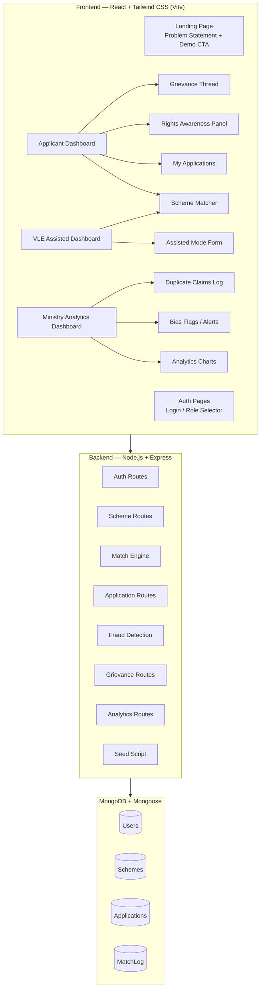

# HEXAGON — Unified Scheme Access, Verification, Rights-Awareness & Grievance Platform

**SIH Problem Statement #92 — Full MERN Stack Implementation Plan**

---

## Problem Context (Pitch Evidence)

| # | Problem | Source | Platform Fix |
|---|---------|--------|-------------|
| 1 | 33+ fragmented MoSJE portals | Digital India/NeGD | Single-window matching engine |
| 2 | 94.5% invalid bank records, ₹1.9cr duplicate overpay, 34L unpaid | CAG Report No. 20/2025 | Duplicate-claim fingerprinting + tamper-evident status log |
| 3 | Rural digital literacy 18.1% vs urban 39.6% | NSSO | VLE Assisted Mode |
| 4 | Middlemen extract bribes for eligible benefits | Field documentation | Self-service matching with plain-language explanations |
| 5 | CPGRAMS grievances disconnected from applications | CPGRAMS structure | In-context grievance threads tied to each application |
| 6 | Bank bias: collateral demands on collateral-free loans, undisclosed rejections (2011–2026 unresolved) | Parliamentary records, DICCI reports | Rights-Awareness module + mandatory rejection-reason disclosure + one-tap escalation |

---

## User Review Required

> [!IMPORTANT]
> **Tailwind CSS**: You specified Tailwind CSS in the tech stack. I'll use **Tailwind CSS v3** with a custom design system featuring a dark-mode-first premium government-tech aesthetic. Confirm if this is acceptable.

> [!IMPORTANT]
> **Authentication**: For a hackathon demo, I'll implement a simple JWT-based auth with pre-seeded user accounts (no OTP/Aadhaar real verification). The login screen will show role-based demo accounts for quick switching. Confirm if this approach works.

> [!IMPORTANT]  
> **Deployment**: This plan builds a local-dev-ready app (`npm run dev` for frontend, `node server.js` for backend). If you need Docker/deployment configs, let me know.

---

## Open Questions

> [!NOTE]
> **Scheme Count**: I'll seed **10 real schemes** (Stand-Up India, MUDRA Shishu/Kishore/Tarun, PMEGP, PM SVANidhi, NSFDC Term Loan, NBCFDC General Loan, New Swarnima, Venture Capital Fund for SCs, NSFDC Micro Credit). Each will have real eligibility rules, document lists, and 2-3 rights statements. Let me know if you want different schemes.

> [!NOTE]
> **Demo Flow**: I'll build a guided demo mode that can be triggered from the landing page, walking through the exact narrative you described. This will use the seeded data to show each module in action.

---

## Architecture Overview



---

## Proposed Changes

### 1. Project Scaffolding

#### [NEW] Root project structure

```
d:\PROJECTS\HEXAGON\
├── client/                    # React + Vite + Tailwind
│   ├── public/
│   ├── src/
│   │   ├── components/        # Reusable UI components
│   │   ├── pages/             # Route-level pages
│   │   ├── context/           # React Context (Auth, Theme)
│   │   ├── hooks/             # Custom hooks
│   │   ├── utils/             # Helper functions
│   │   ├── data/              # Static rights/scheme data
│   │   ├── App.jsx
│   │   ├── main.jsx
│   │   └── index.css          # Tailwind + custom design tokens
│   ├── index.html
│   ├── tailwind.config.js
│   ├── postcss.config.js
│   ├── vite.config.js
│   └── package.json
│
├── server/                    # Express + Mongoose
│   ├── models/                # Mongoose schemas
│   │   ├── User.js
│   │   ├── Scheme.js
│   │   ├── Application.js
│   │   └── MatchLog.js
│   ├── routes/                # Express route handlers
│   │   ├── auth.js
│   │   ├── schemes.js
│   │   ├── match.js
│   │   ├── applications.js
│   │   ├── grievances.js
│   │   └── analytics.js
│   ├── middleware/
│   │   ├── auth.js            # JWT verification
│   │   └── roleCheck.js       # Role-based access
│   ├── utils/
│   │   ├── matchEngine.js     # Rule-based matching logic
│   │   ├── fraudDetection.js  # Duplicate fingerprinting
│   │   └── seedData.js        # Seed script with real schemes
│   ├── server.js              # Express entry point
│   └── package.json
│
├── package.json               # Root scripts (concurrently)
└── README.md
```

---

### 2. Database Models (Mongoose)

#### [NEW] [User.js](file:///d:/PROJECTS/HEXAGON/server/models/User.js)

| Field | Type | Purpose |
|-------|------|---------|
| `name` | String | Full name |
| `email` | String | Login credential |
| `password` | String | Hashed (bcrypt) |
| `role` | Enum: `applicant`, `vle`, `admin` | Access control |
| `category` | Enum: `SC`, `ST`, `OBC`, `General`, `Minority` | Eligibility matching |
| `gender` | Enum: `Male`, `Female`, `Other` | Scheme targeting |
| `age` | Number | Age-based eligibility |
| `businessStage` | Enum: `idea`, `startup`, `growing`, `established` | MUDRA category mapping |
| `sector` | Enum: `manufacturing`, `services`, `trading`, `agriculture` | Sector-based matching |
| `location` | `{ state, district, isRural }` | Location + rural/urban flag |
| `annualIncome` | Number | Income ceiling checks |
| `aadhaarHash` | String | SHA-256 hash for dedup (never stored raw) |
| `isAssistedProfile` | Boolean | Flagged if created by VLE |
| `assistedBy` | ObjectId → User | VLE who created the profile |

#### [NEW] [Scheme.js](file:///d:/PROJECTS/HEXAGON/server/models/Scheme.js)

| Field | Type | Purpose |
|-------|------|---------|
| `name` | String | e.g., "Stand-Up India" |
| `ministry` | String | e.g., "Ministry of Finance" |
| `description` | String | 2-3 sentence summary |
| `schemeType` | Enum: `loan`, `grant`, `subsidy`, `training` | Categorization |
| `eligibilityCriteria` | Object | Rule-based matching fields (see below) |
| `eligibilityCriteria.categories` | [String] | `["SC", "ST", "Women"]` |
| `eligibilityCriteria.genders` | [String] | `["Female"]` or `["Male", "Female", "Other"]` |
| `eligibilityCriteria.ageRange` | `{ min, max }` | Age bounds |
| `eligibilityCriteria.maxIncome` | Number | Income ceiling |
| `eligibilityCriteria.businessStages` | [String] | Matching stages |
| `eligibilityCriteria.sectors` | [String] | Applicable sectors |
| `eligibilityCriteria.locationTypes` | [String] | `["rural"]`, `["urban"]`, or both |
| `requiredDocs` | `[{ name, description, isMandatory }]` | Document checklist |
| `benefits` | `{ loanRange, subsidyPercent, interestRate, description }` | What applicant gets |
| `processSteps` | `[{ stepNumber, title, description, estimatedDays }]` | Full transparency |
| `applicantRights` | `[{ right, explanation, escalationPath }]` | **Key differentiator** |
| `applyDeadline` | Date | null for ongoing schemes |
| `isActive` | Boolean | Scheme status |

#### [NEW] [Application.js](file:///d:/PROJECTS/HEXAGON/server/models/Application.js)

| Field | Type | Purpose |
|-------|------|---------|
| `userId` | ObjectId → User | Applicant |
| `schemeId` | ObjectId → Scheme | Target scheme |
| `status` | Enum: `draft`, `submitted`, `under_review`, `approved`, `rejected`, `escalated` | Current state |
| `statusHistory` | `[{ status, timestamp, changedBy, reason }]` | Tamper-evident audit trail |
| `documentChecklist` | `[{ docName, isUploaded, uploadedAt }]` | Completion tracking |
| `submittedByRole` | Enum: `applicant`, `vle` | Who submitted (Assisted Mode flag) |
| `rejectionReason` | String | **Mandatory** if status = rejected |
| `rejectionCategory` | Enum: `eligibility`, `documents`, `capacity`, `other` | Categorized for analytics |
| `isRejectionValid` | Boolean | Platform flags invalid rejections |
| `escalationRequested` | Boolean | One-tap escalation flag |
| `escalationHistory` | `[{ level, authority, requestedAt, resolvedAt, outcome }]` | Escalation audit trail |
| `grievanceThread` | `[{ message, author, role, timestamp, isResolution }]` | In-context grievance |
| `duplicateFlag` | Boolean | Fraud detection flag |
| `claimFingerprint` | String | SHA-256(aadhaarHash + schemeId) for dedup |

#### [NEW] [MatchLog.js](file:///d:/PROJECTS/HEXAGON/server/models/MatchLog.js)

| Field | Type | Purpose |
|-------|------|---------|
| `userId` | ObjectId → User | Who was matched |
| `schemeId` | ObjectId → Scheme | Which scheme |
| `matchScore` | Number (0–100) | How well they match |
| `matchReasons` | `[{ field, matched, explanation }]` | Plain-language "why you matched" |
| `unmatchedReasons` | `[{ field, explanation }]` | Why partial matches didn't fully qualify |
| `matchedAt` | Date | Timestamp |

---

### 3. Backend Routes & Logic

#### [NEW] Auth Routes — `POST /api/auth/login`, `POST /api/auth/register`, `GET /api/auth/me`
- JWT-based, 24h token expiry
- Password hashed with bcrypt (10 rounds)
- Role returned in token payload

#### [NEW] Match Engine — `POST /api/match/find`
Core rule-based matching algorithm:
```
For each active scheme:
  score = 0, reasons = []
  
  IF user.category IN scheme.eligibilityCriteria.categories → +25, add reason
  IF user.gender IN scheme.eligibilityCriteria.genders → +15, add reason  
  IF user.age BETWEEN scheme.ageRange → +15, add reason
  IF user.annualIncome <= scheme.maxIncome → +15, add reason
  IF user.businessStage IN scheme.businessStages → +15, add reason
  IF user.sector IN scheme.sectors → +10, add reason
  IF user.location.isRural matches scheme.locationTypes → +5, add reason
  
  IF score >= 50 → include in results
  Sort by score DESC
  Save to MatchLog
```
Each reason is a plain-language string like: *"You qualify because you are a woman entrepreneur in the manufacturing sector, and this scheme specifically supports women-led greenfield ventures."*

#### [NEW] Fraud Detection — `POST /api/applications/submit`
Before any application submission:
```
fingerprint = SHA-256(user.aadhaarHash + schemeId)
IF Application.findOne({ claimFingerprint: fingerprint, status != 'rejected' })
  → BLOCK with "Duplicate claim detected" 
  → Log to admin dashboard
```

#### [NEW] Application Routes
- `POST /api/applications` — Create (draft or submitted)
- `GET /api/applications/my` — User's applications
- `PATCH /api/applications/:id/status` — Update status (admin only, rejection requires reason)
- `POST /api/applications/:id/escalate` — One-tap escalation
- `POST /api/applications/:id/grievance` — Add grievance message

#### [NEW] Analytics Routes — `GET /api/analytics/*` (admin only)
- `/overview` — Total applications, approval rate, avg resolution time
- `/rejections` — Rejection reasons grouped by category, scheme, and applicant category (surfaces bias)
- `/duplicates` — Duplicate claims caught
- `/dropoffs` — Applications started but not completed
- `/bias-flags` — Auto-flagged if rejection rate for SC/ST > 2× general category rate

---

### 4. Frontend Pages & Components

#### [NEW] Landing Page (`/`)
- Hero section with problem statement statistics (animated counters)
- 6 problem cards with research citations
- "Start Demo" CTA button
- Modern dark-mode government-tech aesthetic

#### [NEW] Auth Page (`/login`)
- Login form with role-based demo account quick-select buttons
- Demo accounts displayed: `applicant@demo.com`, `vle@demo.com`, `admin@demo.com`

#### [NEW] Applicant Dashboard (`/dashboard`)
- Profile summary card
- "Find Matching Schemes" button → triggers match engine
- Matched schemes list with scores, reasons, and rights preview
- My Applications tracker with status badges and progress bars

#### [NEW] Scheme Match Results (`/match`)
- Cards for each matched scheme showing:
  - Match score (circular progress)
  - Plain-language match reasons (green checkmarks)
  - Document checklist with completion %
  - **Rights panel** (amber/gold highlight): "Before you apply, know your rights:"
  - Process steps timeline
  - "Apply Now" button

#### [NEW] Application Detail (`/application/:id`)
- Status timeline (draft → submitted → under_review → approved/rejected)
- Document upload checklist with progress bar
- If rejected: **Rights-awareness alert** — "This loan is legally collateral-free. The stated rejection reason was: [reason]. This may be invalid. You have the right to escalate."
- One-tap escalation button (prominent, red)
- Grievance thread (chat-style, tied to this application)
- Deadline tracker

#### [NEW] VLE Assisted Mode (`/assisted`)
- Simplified form with larger text, fewer fields per step
- VLE creates profile on behalf of applicant
- Step-by-step wizard (5 steps max)
- All submissions tagged as `submittedByRole: 'vle'`
- Confirmation screen with printable summary

#### [NEW] Ministry Analytics Dashboard (`/admin`)
- Overview cards: Total apps, approval rate, avg resolution time, duplicates caught
- **Rejection Reason Patterns** chart (bar chart by category — surfaces bias)
- **Drop-off Funnel** chart
- **Bias Flag Alerts** — automated alerts when SC/ST rejection rate exceeds threshold
- **Duplicate Claims** log with details
- **Escalation Queue** — pending escalations needing review
- Filterable by scheme, time period, region

---

### 5. Seed Data

#### 10 Real Schemes

| # | Scheme | Ministry | Type | Key Eligibility | Rights Statements |
|---|--------|----------|------|-----------------|-------------------|
| 1 | Stand-Up India | Finance | Loan | SC/ST/Women, greenfield, 18+ | Collateral-free under CGTMSE; 1 SC/ST + 1 woman per branch mandated |
| 2 | MUDRA Shishu | Finance | Loan | Any, up to ₹50K | No collateral required; no processing fee can be charged |
| 3 | MUDRA Kishore | Finance | Loan | Any, ₹50K–5L | Collateral-free under CGFMU; bank cannot ask for guarantor |
| 4 | MUDRA Tarun | Finance | Loan | Any, ₹5L–10L | Collateral-free; rejection must be communicated in writing with reason |
| 5 | PMEGP | MSME | Subsidy+Loan | 18+, 8th pass for >₹10L | SC/ST/Women get 35% subsidy (rural); cannot be denied on caste basis |
| 6 | PM SVANidhi | MoHUA | Loan | Street vendors, CoV/LoR | No middleman authorized; digital payment incentive cashback is your right |
| 7 | NSFDC Term Loan | MoSJE | Loan | SC, income ≤₹5L | Concessional rate is your right; bank cannot charge market rate |
| 8 | NBCFDC General Loan | MoSJE | Loan | OBC, income ≤₹3L | Must be routed through SCA; no agent fees |
| 9 | New Swarnima | MoSJE | Loan | Women, backward classes | Women-only scheme; interest capped at 5% PA |
| 10 | Venture Capital Fund for SCs | MoSJE | Equity | SC entrepreneurs | Equity support; no repayment obligation on equity portion |

#### 20 Sample Applicant Profiles
- Mix of SC, ST, OBC, General, Minority
- Male/Female/Other representation
- Rural and urban locations across 8 states
- Different business stages (idea → established)
- Different sectors and income levels
- 3 profiles designed to trigger duplicate detection
- 2 profiles designed to show the rejection → rights → escalation flow

#### Demo Rejection Scenario (Pre-seeded)
- Applicant "Lakshmi Devi" (SC, Female, rural) applies for Stand-Up India
- Application marked "Rejected" with reason "Insufficient collateral"
- Platform auto-flags: "This rejection reason is invalid — Stand-Up India loans are legally collateral-free under CGTMSE"
- Escalation path shown: Branch Manager → Lead District Manager → SLBC → DFS Nodal Officer

---

### 6. Design System

**Color Palette** (Government-tech premium):
- Primary: Deep Indigo (`#312E81`) → Violet (`#7C3AED`)
- Accent: Amber/Gold (`#F59E0B`) for rights-awareness highlights
- Success: Emerald (`#10B981`)
- Danger: Rose (`#F43F5E`)
- Background: Slate-900 (`#0F172A`) dark mode
- Surface: Slate-800 (`#1E293B`) cards
- Text: Slate-100 (`#F1F5F9`)

**Typography**: Inter (Google Fonts) — clean, modern, highly readable

**UI Patterns**:
- Glassmorphism cards with subtle blur
- Gradient borders on active/focus states
- Animated counters on landing page statistics
- Smooth page transitions
- Status badges with pulsing dots for active states
- Progress bars with gradient fills
- Timeline components for process steps and status history

---

## Verification Plan

### Automated Tests
```bash
# Start MongoDB (must be running)
mongod

# Seed the database
cd server && node utils/seedData.js

# Start backend (port 5000)
npm run dev

# Start frontend (port 5173)  
cd ../client && npm run dev

# Verify API endpoints
curl http://localhost:5000/api/schemes
curl http://localhost:5000/api/auth/login -X POST -H "Content-Type: application/json" -d '{"email":"applicant@demo.com","password":"demo123"}'
```

### Manual Verification (Demo Narrative Walkthrough)
1. **Landing page** loads with animated statistics and 6 problem cards
2. **Login** as `applicant@demo.com` → Applicant dashboard loads
3. **Find schemes** → Match engine returns scored results with plain-language reasons
4. **View rights** → Rights panel shows legal protections before applying
5. **Apply** to Stand-Up India → Document checklist + process steps visible
6. **Duplicate test** → Try applying again → Blocked with fraud alert
7. **Login** as `vle@demo.com` → Assisted Mode wizard works with simplified flow
8. **Login** as `admin@demo.com` → Pre-seeded rejection for "Lakshmi Devi" visible
9. **Admin rejects** with reason "Insufficient collateral" → Platform flags as invalid
10. **Switch to applicant** → Rejection visible with rights alert + escalation button
11. **Escalate** → Escalation logged, visible in admin dashboard
12. **Admin analytics** → Rejection patterns, bias flags, duplicate log all populated
